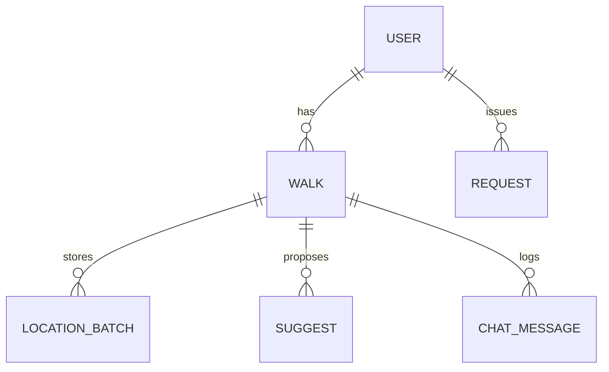

# データ設計（Firestore）

## コレクション構成
```
users/{userId}
users/{userId}/walks/{walkId}
users/{userId}/walks/{walkId}/locations/{batchId}
users/{userId}/walks/{walkId}/suggests/{suggestId}
users/{userId}/walks/{walkId}/chat/{chatId}
requests/{requestId}
```

## ER図（概念）


## ドキュメント定義

### users/{userId}
- `nickname` string
- `email` string
- `fcmToken` string?（プッシュ通知用）
- `createdAt` timestamp
- `lastLoginAt` timestamp

### users/{userId}/walks/{walkId}
- `status` string (`active` / `finished`)
- `startedAt` timestamp
- `finishedAt` timestamp?
- `startLocation` geopoint

### users/{userId}/walks/{walkId}/locations/{batchId}
- `index` number（連番。`1,2,3,...`）
- `count` number（points の件数）
- `points` array
  - `timestamp` timestamp
  - `geo` geopoint
- `createdAt` timestamp
- `updatedAt` timestamp

> 1ドキュメントの上限を超えないよう、`points` は 64 件まで同一ドキュメントに追記し、超えたら次の `index` を作成する。

### users/{userId}/walks/{walkId}/suggests/{suggestId}
- `suggestId` string
- `suggestedAt` timestamp
- `messageId` string（chat 参照）
- `geo` geopoint

### requests/{requestId}
- `requestId` string
- `userId` string
- `walkId` string
- `requestedAt` timestamp
- `status` string (`queued` / `running` / `done` / `failed`)
- `suggestId` string?
- `messageId` string?
- `error` string?
- `createdAt` timestamp
- `updatedAt` timestamp

### users/{userId}/walks/{walkId}/chat/{chatId}
- `chatId` string
- `senderType` string (`system` / `user`)
- `message` string
- `url` string?
- `createdAt` timestamp
- `suggestId` string?

## ID運用
- `walkId` / `suggestId` / `requestId`: 時系列ソート可能なID（例: ULID）
- `chatId`: `timestamp-short-uuid` 形式
- `batchId`: 連番（`1,2,3,...`）

## インデックス（推奨）
- `walks` を `startedAt desc` で取得
- `walks` を `status` でフィルタ
- `suggests` を `suggestedAt desc` で取得
- `chat` を `createdAt asc` で取得
- `requests` を `userId` でフィルタし `requestedAt desc` で取得

## 保持/削除
- 位置情報は散歩中のみ取得し、ユーザーの削除要求で全消去できるようにする
- 不要な詳細履歴は一定期間後に削除できる設計とする（例: 90日）

---

## 関連ドキュメント
- → [API設計](./api.md): REST エンドポイント
- → [システム構成](./system.md): アーキテクチャ全体像
- → [UX仕様](./ux.md): 画面とユーザーフロー
