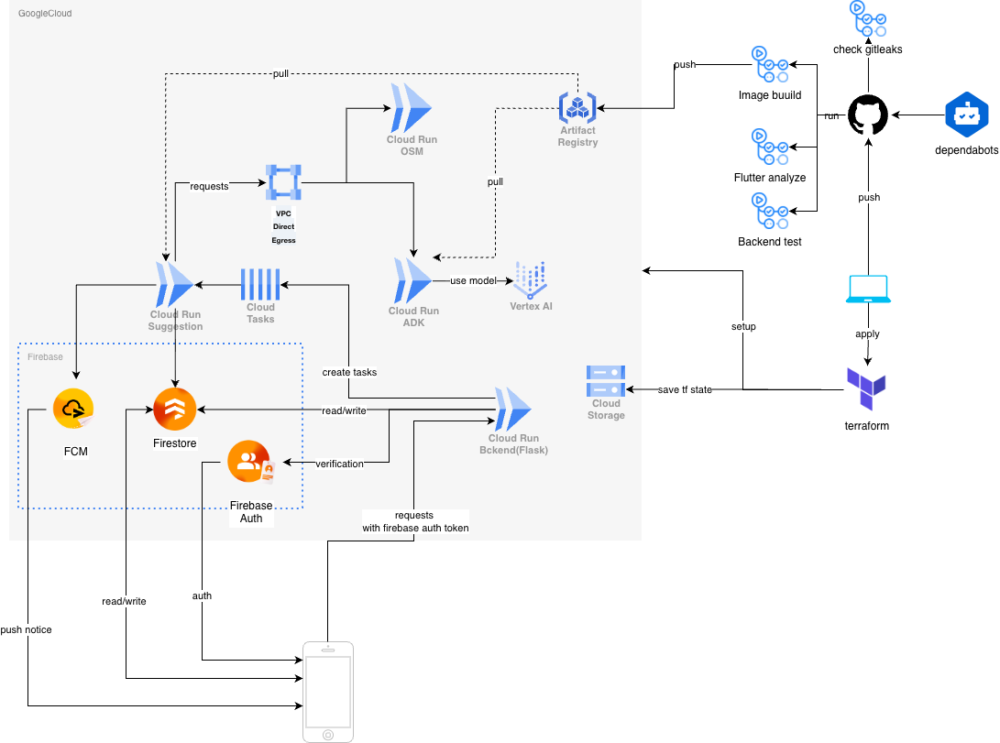
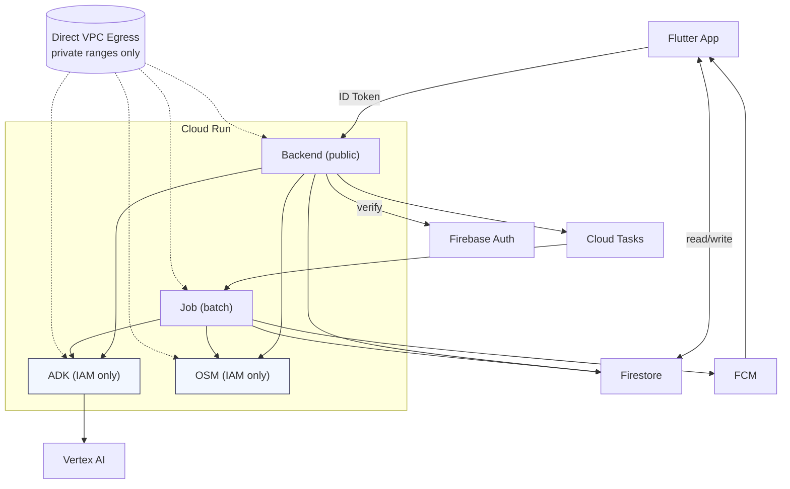
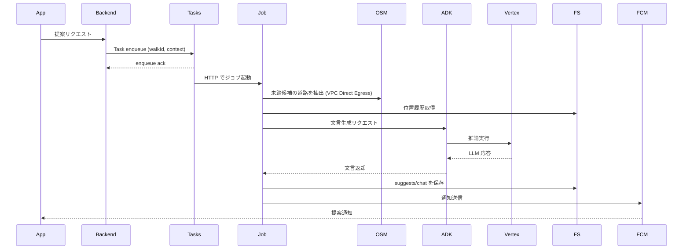

# システム構成

## 構成図（概要）
`spec/images/machi-dan.drawio.png` を参照。Cloud Run（Backend/ADK/OSM/Job）は共通で Direct VPC Egress を使用する。

### 構成図（Mermaid 補足）

## コンポーネント責務
- Flutter App (Riverpod, auto_route, Dio): 認証、位置情報取得、UI描画、通知受信
- Firebase Auth: ID トークン発行/検証
- Firestore: walk/位置/提案/チャットの永続化
- FCM: 提案・更新通知の配信
- Cloud Run Backend (Python / Flask): walk開始/終了、ユーザー登録/管理、軽量な提案リクエスト受付、データ整形、Cloud Tasks へのジョブ投入
- Cloud Tasks: 長時間/重い処理のキューイング。Cloud Run Job を HTTP ターゲットで起動する
- Cloud Run Job: 非同期バッチ（提案生成・通知送信）。ADK/OSM/Firestore/FCM への連携をまとめて実行
- Cloud Run ADK: LLM 用の推論サービス。Vertex AI を利用し、バックエンド/ジョブから呼び出される
- Cloud Run OSM (OSRM): 道路検出と未踏候補の抽出を行うセルフホストサービス（東京エリアのみ）
- Artifact Registry: すべての Cloud Run / Job イメージの保管
- VPC Direct Egress: すべての Cloud Run サービス/Job が使用し、Vertex AI 等への到達性とアウトバウンド制御を確保する

## 主要フロー

### 散歩開始
1. App → Backend: 散歩開始リクエスト（初期位置、ID トークン付き）
2. Backend → Auth: トークン検証
3. Backend → Firestore: walk ドキュメント作成
4. Backend → App: walkId 返却

### 位置更新
1. App は Locus の位置更新ストリームを購読する（distanceFilter: 15m）
2. 位置が更新されたときのみ Firestore の `locations` に追記

### 履歴/提案の閲覧
1. App は Firestore から `walks` / `suggests` / `chat` を読み取る
2. 既存データは読み取り専用で表示する

### 提案生成（非同期・重い処理を Cloud Tasks/Run Job に委譲）

## 未踏エリア抽出（MVP）
1. スタート地点と現在地を結ぶ
2. その線分を直径とする円を定義
3. 円内の道路データを取得
4. ランダムに候補点を選び OSRM で道の存在を確認
5. 位置履歴と照合し、未踏なら採用

> 精密さより「探索感」を優先する

> **東京エリア外の散歩**
> MVP は東京エリアのみ OSRM データを保持するため、エリア外の散歩は位置記録のみ行い、提案は生成しない。

## 通知と提示
- 提案は `suggests` と `chat` に保存してから通知する
- FCM payload に `walkId` / `suggestId` を含め、アプリはピン表示に使用する

## 信頼性/エラーハンドリング
- 提案リクエストは冪等に扱い、同一時間帯の多重実行を避ける
- ADK/外部API失敗時は再試行し、失敗は `suggests` に記録しない
- 通知配信失敗時でも履歴から閲覧可能とする

## セキュリティ/プライバシー
- API は Firebase ID Token を検証する
- Firestore ルールでユーザー自身のデータにのみアクセス可能とする
- 位置情報は散歩中のみ取得し、ユーザーの削除要求で全消去できるようにする
- ADK/OSM は `allow-unauthenticated` を無効化し、Backend/Job のサービスアカウントに `roles/run.invoker` を付与する

## インフラ/開発運用
- IaC は Terraform を使用し、Cloud Run（Backend/ADK/OSM/Job）、Cloud Tasks、Firestore、Auth、FCM などを管理する
- ローカル開発では Firestore Emulator / Auth Emulator を優先利用し、Task や外部呼び出しはスタブ/モックで代替する。可能な範囲で emulator を使い、実サービス呼び出しを最小化する
- Cloud Run サービス/Job は共通で VPC Direct Egress（private ranges only）を有効化し、Vertex AI などの外部エンドポイントへの到達を統制する

### Terraform 運用手順（手作業）
1. GCP プロジェクトを作成し、課金アカウントを紐付ける
2. 認証を設定する（`gcloud auth login` / `gcloud auth application-default login` / `gcloud config set project <PROJECT_ID>`）
3. tfstate バケットを作成する（例: `gs://<PROJECT_ID>-tfstate`）
4. `infrastructure/terraform/terraform.tfvars.example` をコピーして `infrastructure/terraform/terraform.tfvars` を作成する
5. `terraform init -backend-config="bucket=<PROJECT_ID>-tfstate" -backend-config="prefix=terraform/state"` を実行する
6. `terraform plan` / `terraform apply` を実行する

補足:
- statefile は GCS バケット（`gs://<PROJECT_ID>-tfstate`）の `terraform/state` 配下に保存する
- `terraform.tfvars` はローカル専用で Git 管理しない
- PR 作成時の GitHub Actions で `fvm flutter analyze` を実行し、Flutter 変更（`src/frontend/aruku_pallarel/**` または該当ワークフロー変更）時に静的解析のゲートにする

---

## 関連ドキュメント
- → [プロダクト概要](./overview.md): コンセプトとスコープ
- → [UX仕様](./ux.md): 画面構成とユーザーフロー
- → [API設計](./api.md): REST エンドポイント詳細
- → [データ設計](./data-model.md): Firestore スキーマ
- → [AI設計](./ai.md): LLM による提案生成
- → [Flutter技術仕様](./flutter.md): クライアント実装
