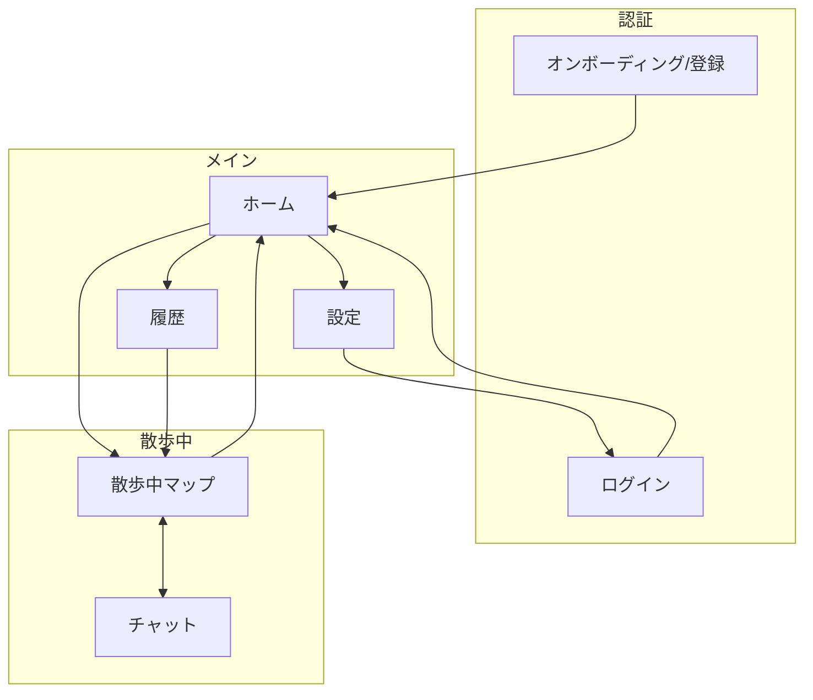
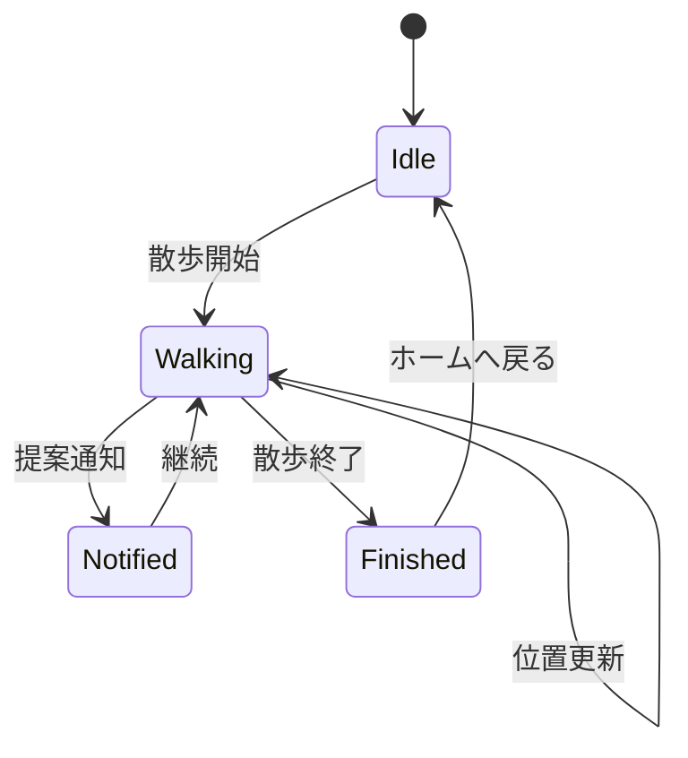

# UX仕様

## 画面一覧
- オンボーディング/登録
- ログイン
- ホーム
- 散歩中マップ（flutter_map + Carto/OSM タイル / 右上 Info で提供元を確認 / 軌跡ライン表示）
- チャット（提案閲覧）
- 履歴
- 設定（マップテーマ選択）

## 画面構成図

### 画面遷移の説明
| 遷移 | トリガー |
|------|----------|
| オンボーディング → ホーム | 新規登録完了 |
| ログイン → ホーム | ログイン成功 |
| ホーム → 散歩中マップ | 散歩開始ボタン |
| 散歩中マップ ↔ チャット | チャットボタン / 戻る |
| 散歩中マップ → ホーム | 散歩終了ボタン |
| ホーム → 履歴 | 履歴ボタン |
| 履歴 → 散歩中マップ | 過去の散歩を選択（読み取り専用） |
| ホーム → 設定 | 設定ボタン |
| 設定 → ログイン | ログアウト |

## ユーザーフロー（GIVEN / WHEN / THEN）

### 1. アカウント登録
- GIVEN: アプリ初回起動で未登録
- WHEN: nickname / email / password を入力して登録
- THEN:
  - ホーム画面へ遷移
  - 次回起動以降はログイン不要
  - Firestore に user ドキュメントが作成される

### 2. ログイン
- GIVEN: 既存アカウント、ログアウト状態
- WHEN: email / password でログイン
- THEN:
  - ホーム画面へ遷移
  - 次回起動以降はログイン不要
  - ログアウト時はログイン画面へ戻る
  - Firebase Auth のセッションは端末に保持されるため、ログアウトしない限り自動ログインされる

### 3. 散歩開始
- GIVEN: ホーム画面
- WHEN: 散歩開始ボタンを押す（初期位置を送信）
- THEN:
  - すでに active な散歩がある場合はそれを再開する
  - 散歩中マップへ遷移し現在地と軌跡ラインが表示される
  - Firestore に walk ドキュメントとサブコレクションが作成される

### 4. 位置情報収集
- GIVEN: 散歩開始済み（フォアグラウンド/バックグラウンド）
- WHEN:
  - Locus で位置情報の更新を受信（distanceFilter: 15m）
- THEN:
  - Firestore に位置情報が追記される
  - 位置情報権限がない場合は許可の案内と設定画面への導線を表示する

> **バックグラウンド動作**
> - iOS: 「常に許可」の位置情報権限を取得し、Background Modes (location) を有効化
> - Android: Foreground Service + `ACCESS_BACKGROUND_LOCATION` 権限で通知バーに常駐

### 4.1 位置偽装（開発用）
- GIVEN: 設定で「位置偽装」を ON
- WHEN: 散歩中マップを 2 秒長押しする
- THEN:
  - 長押しした地点を現在地として扱う
  - OFF に戻すと偽装位置をクリアする

### 5. 提案リクエスト（自動）
- GIVEN:
  - 散歩開始済み
  - 直近の提案から 5 分経過、または散歩開始から 5 分経過
- WHEN: アプリが自動で提案リクエストを送信（5 分ごとのタイマー）
- THEN:
  - 十分に移動していれば `ok` を返し非同期で提案生成
  - 移動量が不足していれば `ng` を返す

### 6. 提案通知
- GIVEN: 散歩開始済み、提案生成済み
- WHEN: FCM が届いてアプリを開く/開いている
- THEN:
  - マップ上にピンが表示される
  - 提案はチャットに保存される

### 7. 提案確認（チャット）
- GIVEN: 提案された場所が1件以上ある
- WHEN: ピンをタップ/チャットボタンを押す
- THEN:
  - チャット画面で提案メッセージを閲覧できる
  - URL をタップすると外部ブラウザで地図（ストリートビュー/Google Maps）を開く

### 8. 散歩終了
- GIVEN: 散歩開始済み
- WHEN: 散歩終了ボタンを押す
- THEN: ホーム画面へ戻る

### 9. 履歴確認
- GIVEN: ホーム画面
- WHEN: 「いままでの散歩」を選択
- THEN: マップとチャットを読み取り専用で閲覧できる

### 10. ログアウト
- GIVEN: ホーム画面
- WHEN: 設定画面からログアウトを実行
- THEN: ログイン画面へ遷移

### MVP外（将来拡張）
- チャットで「休める場所」「トイレ」などを検索する依頼

## 状態遷移（散歩）

---

## 関連ドキュメント
- → [プロダクト概要](./overview.md): コンセプトとスコープ
- → [システム構成](./system.md): アーキテクチャと処理フロー
- → [API設計](./api.md): REST エンドポイント
- → [データ設計](./data-model.md): Firestore スキーマ
