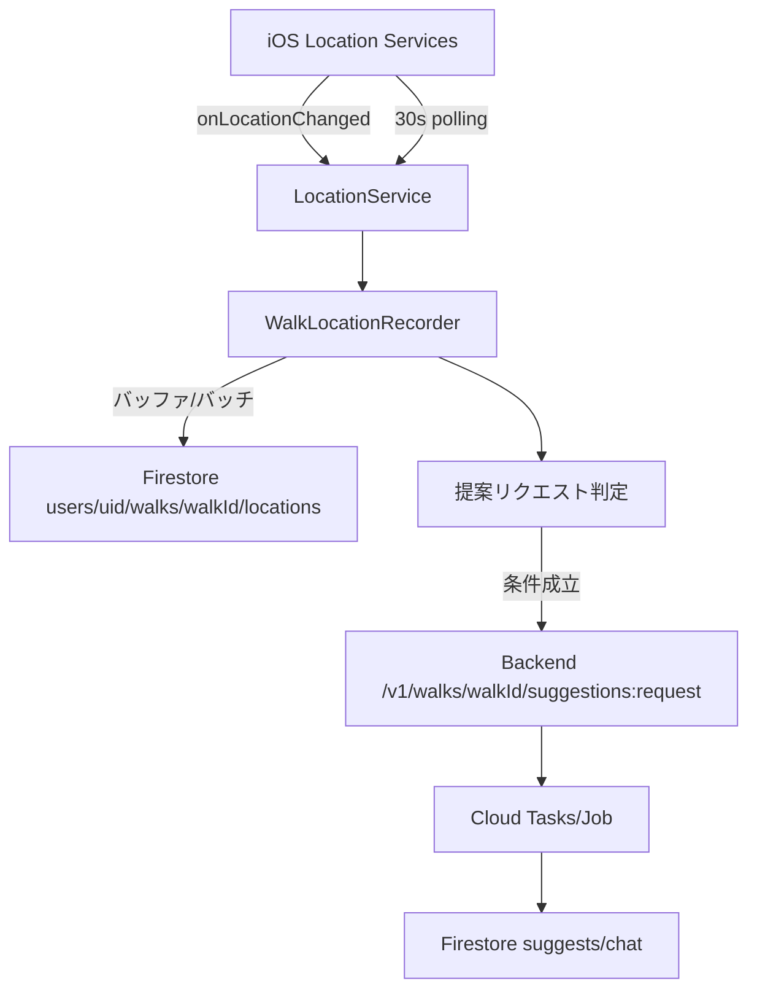

# iOSバックグラウンド位置更新の安定化（locationプラグイン移行）

## 背景
- Locus のバックグラウンド同期が安定せず位置更新が届かない
- 安定性優先で別ライブラリ/ポーリングを許容してでも動作させたい

## ゴール
- iOS バックグラウンドでも位置更新が継続される
- 位置更新が Firestore に反映され、提案リクエストが動作する

## ToDo
- [x] 位置更新ライブラリを `location` に移行する
- [x] iOS バックグラウンド設定（Background Modes / enableBackgroundMode）を整理する
- [x] 位置ストリーム/現在地取得の呼び出しを置き換える
- [x] ポーリング（30s）で補完する
- [x] spec を更新する
- [ ] 実機でバックグラウンド位置更新を確認する

## 受け入れ条件
- 実機でバックグラウンド中の位置更新が記録される
- 散歩終了後にホームへ戻れる

## システム/データフロー（現在）

## 作業ログ（実施内容）
- Locus を撤去し、`location` に統一
- `enableBackgroundMode` を有効化し、iOS バックグラウンド継続を狙う
- 位置ストリーム/現在地取得の呼び出しを `location` へ置換
- 位置ストリームが途切れるケースを 30 秒ポーリングで補完
- 仕様書（system/ux/flutter/api）を `location` 前提に更新

## 変更ファイル
- `src/frontend/aruku_pallarel/pubspec.yaml`
- `src/frontend/aruku_pallarel/pubspec.lock`
- `src/frontend/aruku_pallarel/ios/Podfile.lock`
- `src/frontend/aruku_pallarel/lib/features/walk/services/location_service.dart`
- `src/frontend/aruku_pallarel/lib/features/walk/provider/walk_tracking_provider.dart`
- `src/frontend/aruku_pallarel/lib/features/walk/provider/walk_location_recorder_provider.dart`
- `src/frontend/aruku_pallarel/lib/screens/home/home_screen.dart`
- `src/frontend/aruku_pallarel/lib/screens/walk/walk_screen.dart`
- `spec/system.md`
- `spec/ux.md`
- `spec/flutter.md`
- `spec/api.md`
